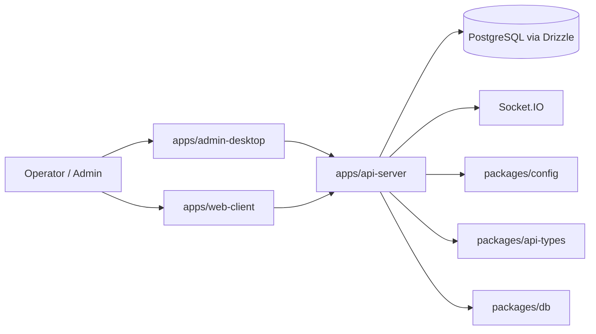

# ARCHITECTURE.md

## High-Level Layout

## Core Runtime Pieces
- The API server owns auth, users, BOMs, sessions, metrics, audit logging, and realtime transport.
- The desktop app is the operator shell and currently uses a routed React UI inside Electron.
- The web client includes the log viewer and shared client behavior.
- Shared packages keep env validation, database schema, and client calls aligned.

## Security Flow
- Cookie-based JWT auth is the main session mechanism.
- CSRF middleware is part of the request chain.
- Security headers are applied centrally.
- Rate limiting has a Redis/database/memory fallback strategy.
- Socket.IO auth uses a short-lived token issued by the API.

## Current Architectural Gaps
- The desktop auth context is still mocked instead of using the live API.
- Some UI pages are stubs.
- Internal log access is exposed too broadly.
- The user detail endpoint bypasses the intended role boundary.
